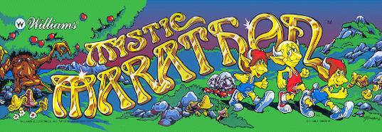
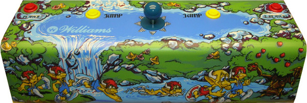

# [Arcade: Mystic Marathon](https://en.wikipedia.org/wiki/Mystic_Marathon) for [MiSTer](https://mister-devel.github.io/MkDocs_MiSTer/)



Original core developed by [darfpga](https://github.com/darfpga)

Ported to MiSTer by [birdybro](https://github.com/birdybro) and [JasonA](https://github.com/JasonA-dev)

## Description

This is a simulation model of the **Mystic Marathon** hardware. Mystic Marathon is an early Sports style game where you are a Benkin racing other Benkins across a difficult obstacle course. It was programmed by [Kristina Donofrio](https://www.arcade-history.com/index.php?page=person&name=Kristina+Donofrio) and [Ken Graham](https://www.arcade-history.com/index.php?page=person).

Original source is located in `doc/`

## Controls



There is only 1 player allowed to play at a time. If you play in 2 player mode, each player takes turns.

| Name     | Description                   |
| -------- | ----------------------------- |
| Jump     | You jump                      |
| Left     | You go left                   |
| Right    | You go right                  |
| Up       | You go up                     |
| Down     | You go down                   |
| Coin     | Put in a coin                 |
| 1P Start | Start the game with 1 Player  |
| 2P Start | Start the game with 2 Players |

## OSD Options

Mystic Marathon had a peculiar system of DIPs. See the manual in `doc/` for the original source of the information.

When you press the "Advance" button in the OSD, this enables you to access the bookkeeping totals by then pressing "Auto Up" in the OSD. Currently the data in here is not saved to the MiSTer but that may come at a later time. 

If you want to change any options, then press "Auto Up" again to see the Game Adjustments menu. Here you use up and and down to move to whatever option you want to change and then use the right and left inputs to modify the desired setting. You then push "Auto up" again to set the changes.

If you press "Advance" again, it will return to it's original state (not in service mode), but "Auto Up" now will cycle through various test programs that the arcade board used to have.

High Score reset is another internal button, and it makes the game pause for a second until the high score resets.

One of the coolest features of the Williams service menu was you could customize the attract mode screen with your own letters!

## Status

* The game seems to play fine, colors are closer to what the original board would have output most likely, maybe a little muted, LUT needs some slight adjustments later.
* Video has this occasional blip where you see a line scrolling, it's possible that sync is not properly aligned internally.
* Video blanks are slightly off, you can see the last line at the top of the screen and then a black line.

## To-Do

* Pause.
* HiScore.
* MiSTer DIP system not implemented yet (DIPS are defined away as CPU behavior currently in the PIA due to them not being a standard DIP system)
* Analog video is untested as my scaler doesn't sync to the image, may need to clean that up somewhat.

## ROM Files Instructions

ROMs are not included! In order to use this arcade core, you will need to provide the correct ROM file yourself.

To simplify the process .mra files are provided in the releases folder, that specify the required ROMs with their checksums. The ROMs .zip filename refers to the corresponding file from the MAME project.

Please refer to [https://github.com/MiSTer-devel/Main_MiSTer/wiki/Arcade-Roms-and-MRA-files](https://github.com/MiSTer-devel/Main_MiSTer/wiki/Arcade-Roms-and-MRA-files) for information on how to setup and use the environment.

Quick reference for folders and file placement:

```
/_Arcade/<game name>.mra  
/_Arcade/cores/<game rbf>.rbf  
/_Arcade/mame/<mame rom>.zip  
/_Arcade/hbmame/<hbmame rom>.zip  
```

### Original readme from darfpga

```
-------------------------------------------------------------------------------
-- Mystic Marathon by Dar (darfpga@aol.fr) (05 March 2022)
-- http://darfpga.blogspot.fr
-- https://sourceforge.net/projects/darfpga/files
-- github.com/darfpga
--
--  Terasic board MAX10 DE10 Lite
-------------------------------------------------------------------------------
-- gen_ram.vhd & io_ps2_keyboard
-------------------------------- 
-- Copyright 2005-2008 by Peter Wendrich (pwsoft@syntiac.com)
-- http://www.syntiac.com/fpga64.html
-------------------------------------------------------------------------------
-- cpu09l - Version : 0128
-- Synthesizable 6809 instruction compatible VHDL CPU core
-- Copyright (C) 2003 - 2010 John Kent
-------------------------------------------------------------------------------
-- cpu68 - Version 9th Jan 2004 0.8
-- 6800/01 compatible CPU core 
-- GNU public license - December 2002 : John E. Kent
-------------------------------------------------------------------------------
-- Educational use only
-- Do not redistribute synthetized file with roms
-- Do not redistribute roms whatever the form
-- Use at your own risk
-------------------------------------------------------------------------------
--  Video 15KHz is OK, 
--
--  This is not VGA, you have to use a TV set with SCART plug
--
--    SCART(TV) pin  - signal -  VGA(DE10) pin
--               15  -  red   -  1          
--               11  - green  -  2
--                7  -  blue  -  3  
--           5,9,13  -  gnd   -  5,6,7
--   (comp. sync)20  - csync  -  13 (HS)   
--  (fast commut)16  - commut -  14 (VS)
--            17,18  -  gnd   -  8,10 
--
-------------------------------------------------------------------------------
-- Version 0.0 -- 18/03/2022 -- 
--	initial version 
-------------------------------------------------------------------------------
--
-- Main features :
--  PS2 keyboard input @gpio pins 35/34 (beware voltage translation/protection)
--  Audio pwm output   @gpio pins 1/3 (beware voltage translation/protection)
--
-- Uses 1 pll for 12MHz and 120MHz generation from 50MHz
--
-- Board key :
--   0 : reset game
--
-- Keyboard players inputs :
--
--   F3 : Add coin
--   F2 : Start 2 players
--   F1 : Start 1 player
--   SPACE       : Fire  
--   RIGHT arrow : Move right
--   LEFT  arrow : Move left
--   UP    arrow : Move up 
--   DOWN  arrow : Move down
--   CTRL        : N.U.
--   W(Z)        : N.U.
--
-- Keyboard Service inputs French(english) :
--
--   A(Q) : advance
--   U(U) : auto/up (!manual/down)
--   H(H) : high score reset
--
-- To enter service mode press 'advance' key while in game over screen
-- Enter service mode to tune game parameters (difficulty ...)
-- Tuning are lost at power OFF, for permanent tuning edit/set parameters
--   within mystic_marathon_cmos_ram.vhd and recompile.
--
-------------------------------------------------------------------------------
-- Use make_mystic_marathon_proms.bat to build vhd file and bin from binaries
-- Load sdram with external rom bank -> use sdram_loader_de10_lite.sof + key(0)
-------------------------------------------------------------------------------
-- Program sdram content with this Mystic Marathon rom bank loader before 
-- programming Mystic Marathon game core :
--
-- 1) program DE10_lite with Mystic Marathon sdram loader
-- 2) press key(0) at least once (digit blinks during programming)
-- 3) program DE10_lite with Mystic Marathon core without switching DE10_lite OFF
-------------------------------------------------------------------------------
-- Used ROMs by make_mystic_marathon_proms.bat

> mystic_marathon_prog2
   mm02_2.a09 CRC(3a776ea8) IC9 
   mm03_2.a10 CRC(6e247c75) IC10

> mystic_marathon_bank_a
   mm18_1.a26 CRC(9b391a81) IC26
   mm16_1.a24 CRC(399e175d) IC24
   mm14_1.a22 CRC(191153b1) IC22

> mystic_marathon_bank_b
   mm17_1.a25 CRC(d36f0a96) IC25
   mm15_1.a23 CRC(cd5d99da) IC23
   mm13_1.a21 CRC(ef4b79db) IC21
   mm12_1.a19 CRC(a1f04bf0) IC19

> mystic_marathon_bank_c
   mm11_1.a18 CRC(f537968e) IC18
   mm09_1.a16 CRC(3bd12f6c) IC16
   mm07_1.a14 CRC(ea2a2a68) IC14
   mm05_1.a12 CRC(b514eef3) IC12

> mystic_marathon_bank_d
   mm10_1.a17 CRC(d6a37509) IC17
   mm08_1.a15 CRC(6f1a64f2) IC15
   mm06_1.a13 CRC(2e6795d4) IC13
   mm04_1.a11 CRC(c222fb64) IC11

> mystic_marathon_sound
   mm01_1.a08 CRC(65339512) IC8 

> mystic_marathon_graph1
   mm20_1.b57 CRC(5c0f4f46) IC57

> mystic_marathon_graph2
   mm21_1.b58 CRC(cb90b3c5) IC58

> mystic_marathon_graph3
   mm19_1.b41 CRC(e274df86) IC41

> mystic_marathon_decoder
   ic60.bpr CRC(0ea3f7fb) IC60

-------------------------------------------------------------------------------
-- Misc. info
-------------------------------------------------------------------------------
-- Main bus access
--  > Main address bus and data bus by CPU 6809
--  > Main address bus and data bus by DMA (blitter) while CPU is halted.
--
-- CPU and DMA can read/write anywhere from/to entire 64K address space
-- including video ram, color palette, tile map, cmos_ram, peripherals, roms,
-- switched rom banks, ...

--
-- Page register control allows to select misc. banked access (rom, ram). 
-------------------------------------------------------------------------------
-- Video ram : 3 banks of 16Kx8 (dram with ras/cas)
--  > interleaved bank access by CPU, 8bits read/write
--  > interleaved bank access by DMA, 8bits read, 2x4bits independent write
--  > simultaneous (3 banks) access by video scanner, 24bits at once
-- 
-- In original hardware, every 1us there is 1 access to video ram for CPU/DMA
-- and 1 access for video scanner. Thus DMA read/write cycle required 2us when
-- reading source is video ram. DMA read/write cycle required only 1us when
-- reading source is not video ram.
--
-- Higher part of video ram is not displayed on screen and is used as working
-- ram by CPU including stack (SP).
-------------------------------------------------------------------------------
-- Foreground (bitmap - video ram)
--  > 24 bits / 1us => 6 horizontal pixels of 4bits (16 colors)
--  > 6 bits register (64 color banks)
-------------------------------------------------------------------------------
-- Background (tile map : tile is 24x16 pixels)
--
--  > 16 horizontal tiles of 4x6 pixels, 16 vertical tiles of 16 pixels.
--  > map ram 2048x8
--      in  : 7 bits horizontal (4 bits + scroll) + 4 bits vertical
--      out : 128 possible tiles + flip control
--
--  > Graphics 3x8Kx8 roms
--      in  : 2 bits horizontal + 4 bits vertical + 7 bits tile code 
--      out : 24 bits = 6 pixels x 4 bits
--
--  > 24 bits / 1us => 6 horizontal pixels of 4bits (16 colors)
--  > 5 bits register + 1 bits from vertical video scanner (64 color banks)
-------------------------------------------------------------------------------
-- Palette 1024 colors x 16 bits
--  > in  10 bits from foreground or background data
--  > out 4 bits red, 4 bits green, 4 bits blue, 4 bits intensity 
-------------------------------------------------------------------------------
```
